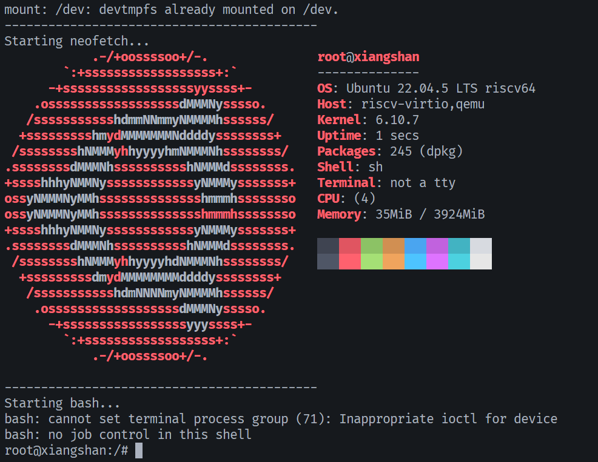

# autobuild

Auto build rootfs(ubuntu-base), especially for riscv64.

The init proc (here is the ./busybox) is from busybox rootfs.

The init proc will run rcS, in which I place some simple commands, include:
- mount proc & sysfs
- exec neofetch to print some system information
- change to bash by executing /bin/bash

Due to neofetch is little slow, I change neofetch to pfetch.

### Usage:

```bash
sudo ./mk-base-ubuntu.sh riscv64
./mk-ubuntu-rootfs.sh riscv64
```
You can get the ubuntu-rootfs.ext4. It is a simple rootfs, mainly used for experiments.

### Test:
Use this command to simply test.
```bash
qemu-system-riscv64 -machine virt,aclint=on,aia=aplic-imsic \
        -bios default -cpu rv64 -smp 4 -m 4G -nographic \
        -kernel ./Image \
        -drive if=none,file=./ubuntu-rootfs.ext4,id=hd1,format=raw \
        -device virtio-blk-device,drive=hd1 \
        -append "root=/dev/vda rw console=ttyS0"
```

You can get:




Note: Please don't use in production environment.

### Reference:

This is not completely original, and based on:

- https://github.com/LubanCat/sophon-image-build

- https://github.com/kvm-riscv/howto
